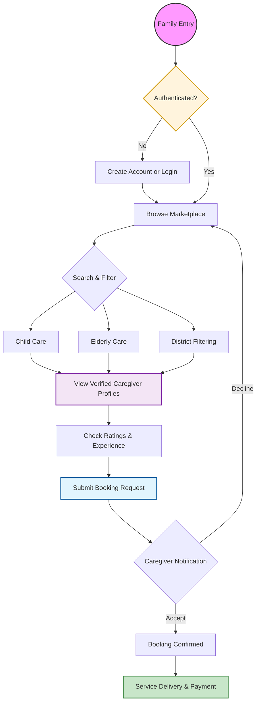

<div align="center">

<p align="center">
  
</p>

# 🏥 Care.IO

### Next-Gen Caregiver Marketplace
**Architecting Trust through Scalable Technology & Compassion**

<br/>

[](https://care-io-eight.vercel.app/)
[](https://nextjs.org/)
[](https://www.mongodb.com/)
[](https://www.framer.com/motion/)

<br/>

[🌐 Live Demo](https://care-io-eight.vercel.app/) &nbsp;•&nbsp; [📂 Repository](https://github.com/rabiulislam5334/Care.IO) &nbsp;•&nbsp; [🛠️ Tech Stack](#-tech-stack) &nbsp;•&nbsp; [🚀 Quick Start](#-quick-start)

</div>

---

## 📑 Table of Contents

- [About the Project](#-about-the-project)
- [Key Capabilities](#-key-capabilities)
- [Service Architecture](#-service-architecture)
- [Tech Stack](#-tech-stack)
- [Key Sections](#-key-sections)
- [Quick Start](#-quick-start)
- [Environment Variables](#-environment-variables)
- [Connect](#-connect)

---

## 🌟 About the Project

**Care.IO** is a production-ready caregiver marketplace platform built for families seeking trusted, verified caregivers across Bangladesh. It bridges the gap between families in need and qualified professionals — offering Child Care, Elderly Support, and specialized Nursing services through a seamless digital experience.

> _Redefining home care services with trust and technology. 🇧🇩_

---

## ✨ Key Capabilities

<table>
  <tr>
    <td width="33%" valign="top">
      <h3>👶 Smart Matching</h3>
      <p>Dynamic filtering for Child Care, Elderly Support, and specialized Nursing based on location and budget preferences.</p>
    </td>
    <td width="33%" valign="top">
      <h3>🛡️ Verified Profiles</h3>
      <p>Deep-vetting system for caregivers with verified credentials, real ratings, and detailed experience showcases.</p>
    </td>
    <td width="33%" valign="top">
      <h3>📅 Instant Booking</h3>
      <p>Seamless scheduling flow with real-time availability checks and complete service request management.</p>
    </td>
  </tr>
  <tr>
    <td width="33%" valign="top">
      <h3>🔐 JWT Authentication</h3>
      <p>Secure, token-based authentication system ensuring data privacy for both families and caregivers.</p>
    </td>
    <td width="33%" valign="top">
      <h3>📍 Location-Based Search</h3>
      <p>District-level filtering to find the nearest, most relevant caregivers in your area.</p>
    </td>
    <td width="33%" valign="top">
      <h3>⭐ Ratings & Reviews</h3>
      <p>Transparent review system that helps families make informed decisions based on real experiences.</p>
    </td>
  </tr>
</table>

---

## 🏗️ Service Architecture



---

## 🛠️ Tech Stack

| Category | Technologies |
| :--- | :--- |
| **Frontend** | Next.js 15, React 19, Tailwind CSS, Framer Motion, Lucide React |
| **Backend** | Next.js API Routes, JWT Authentication |
| **Database** | MongoDB, Mongoose |
| **Interactions** | Swiper.js, TanStack Query, React Hook Form |
| **Deployment** | Vercel |

---

## 📸 Key Sections

| Section | Description |
| :--- | :--- |
| **Hero Section** | High-impact visual entrance with interactive floating trust-badges |
| **Marketplace** | Live service grid with dynamic price rendering and location tracking |
| **Process Flow** | 3-step visual guide — Search → Book → Get Care — for smooth user onboarding |
| **Why Choose Us** | Glassmorphic dark-themed section highlighting platform trust and security |
| **Caregiver Profiles** | Rich profile cards with credentials, experience, ratings, and booking CTA |

---

## 🚀 Quick Start

### Prerequisites

Make sure you have the following installed:

- [Node.js](https://nodejs.org/) `v18+`
- [npm](https://www.npmjs.com/) or [yarn](https://yarnpkg.com/)
- A [MongoDB](https://www.mongodb.com/) instance (local or Atlas)

### Installation

**1. Clone the repository**

```bash
git clone https://github.com/rabiulislam5334/Care.IO.git
cd Care.IO
```

**2. Install dependencies**

```bash
npm install
# or
yarn install
```

**3. Configure environment variables**

Create a `.env.local` file in the root directory:

```env
MONGODB_URI=your_mongodb_connection_string
JWT_SECRET=your_jwt_secret_key
NEXT_PUBLIC_API_URL=http://localhost:3000/api
```

**4. Run the development server**

```bash
npm run dev
# or
yarn dev
```

Open [http://localhost:3000](http://localhost:3000) in your browser to see the app.

---

## ⚙️ Environment Variables

| Variable | Description | Required |
| :--- | :--- | :---: |
| `MONGODB_URI` | MongoDB connection string | ✅ |
| `JWT_SECRET` | Secret key for JWT token signing | ✅ |
| `NEXT_PUBLIC_API_URL` | Base URL for API calls | ✅ |

---

## 📬 Connect

Built with ❤️ by **Rabiul Islam**

📧 [rabiulislam5334@gmail.com](mailto:rabiulislam5334@gmail.com)  
🔗 [LinkedIn](https://www.linkedin.com/in/developerrabiul/)  
📂 [GitHub](https://github.com/rabiulislam5334/Care.IO)

---

<div align="center">

**⭐ If you found this project helpful, please consider giving it a star!**

_Care.IO — Redefining home care services with trust and technology. 🇧🇩_

</div>
